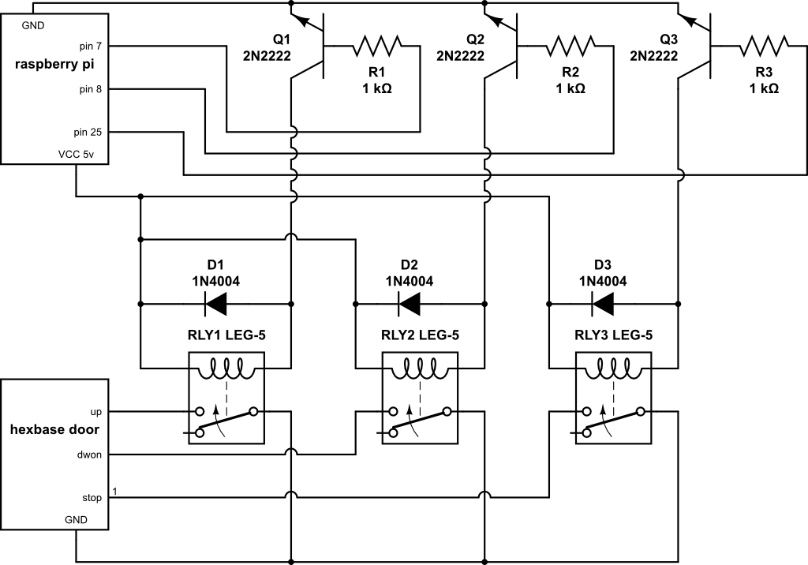

# HEXBASE telegram door bot

A [telegram](https://telegram.org/) bot for the roll-up door of [HexBase](https://github.com/lug-tw/HexBase).


## Available commands

|command|  note         |
|-------|---------------|
|`/ping`|life check     |
|`/up`  |scroll up      |
|`/down`|scroll down    |
|`/stop`|stop scrolling |

# Synopsis

- Prepare hardware.
- Install python and go (>=1.5)
- Build binary.
- Prepare telegram bot token, put it into a file.
- `python daemon.py`
- `hexbase-telegram-door-bot -k 10_bytes_hexdecimal_string_as_secret_key -t your_token_file`

# Installation
```shell

# clone the repo
mkdir ~/dev && cd dev
git clone https://github.com/lug-tw/hexbase-telegram-door-bot.git
cd hexbase-telegram-door-bot/systemd


# change path to /home/pi/dev/hexbase-telegram-door-bot
vim  doorctl.service
vim doorctl_systemd.sh


# install systemd service
cp doorctl.service .config/systemd/user/
systemctl --user enable doorctl
systemctl --user start doorctl
```

# Contribute

### Go part

```shell
# setup go env and download goimports
export GOPATH=$HOME/go
export PATH=$PATH:$GOPATH/bin
which goimports || go install golang.org/x/tools/cmd/goimports

# fetch latest code
go get -u -d github.com/lug-tw/hexbase-telegram-door-bot

# hack, hack, hack
cd $GOPATH/src/github.com/lug-tw/hexbase-telegram-door-bot
your_favorite_editor bot.go

# reformat the code, build and upload
goimports -w bot.go

# cross compile to Raspberry Pi architecture
GOARCH=arm go build -a
```

### Python

```shell
# install flake8 syntax checker
sudo pacman -S flake8

# hack, hack, hack
your_favorite_editor daemon.py

# run syntax check
flake8 daemon.py
```

### Testing

```shell
# launch python daemon
python daemon.py &

socat - UNIX-CONNECT:/tmp/doorctl
```

## Circuit design



## Hardware

- [Raspberry Pi Model A](https://www.raspberrypi.org/products/model-a/)
- [文華 69 萬用 PCB](http://www.pcstore.com.tw/scshop/M09101350.htm)


### previous prototype

- Our Raspberry Pi and the bread board


